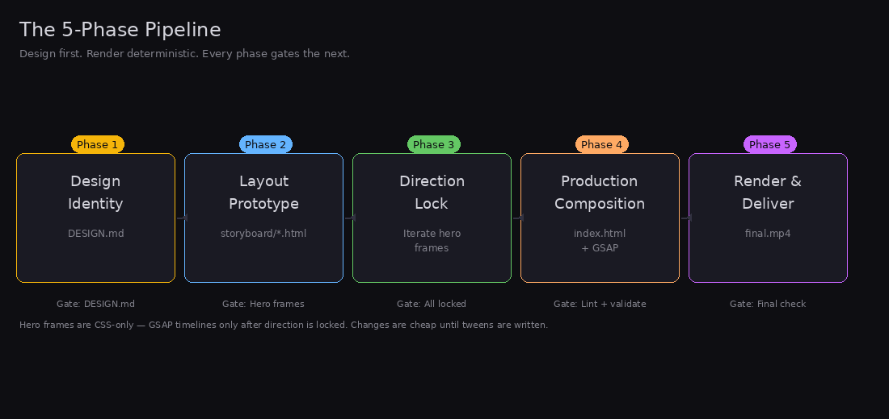
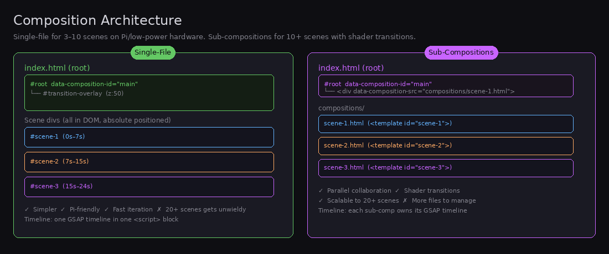
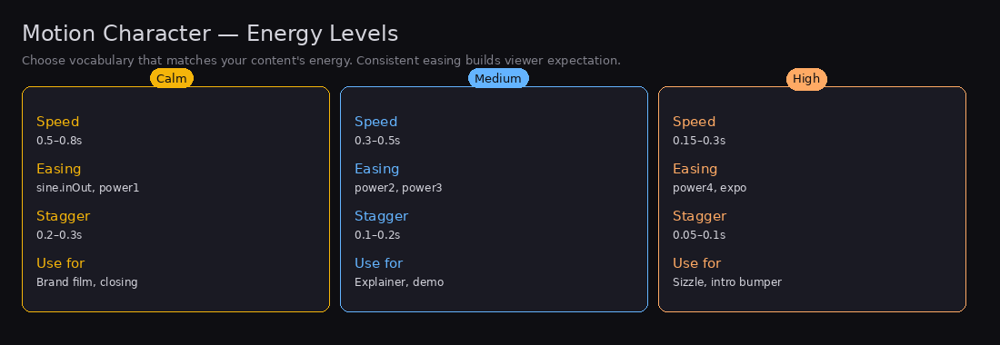
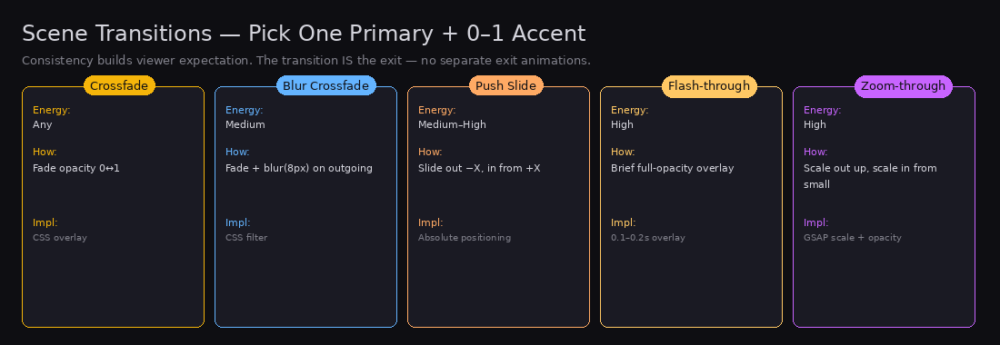
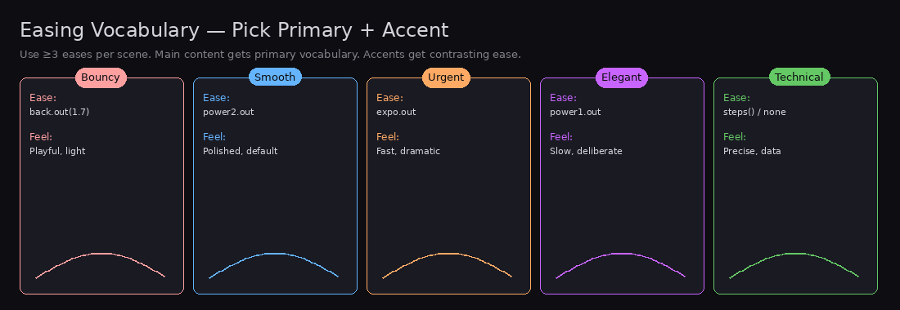
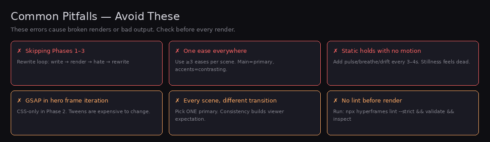

# HyperFrames Studio

**Design-first, render-deterministic motion graphics.** Plan the visual direction, motion character, and brand identity before writing a single GSAP tween. Then compose production HTML and render to MP4 with the HyperFrames engine.

Built on top of Huashu-Design's design planning framework and HyperFrames' deterministic rendering pipeline. Self-contained — no parent skill dependencies.

---

## Quick Start

```bash
# 1. Check prerequisites
npx hyperframes doctor

# 2. Run the 5-phase pipeline (see below)

# 3. Validate before render
npx hyperframes lint --strict && npx hyperframes validate && npx hyperframes inspect

# 4. Render
npx hyperframes render --quality high --output final.mp4
```

**Prerequisites:** `node`, `ffmpeg`, `npx`

---

## The 5-Phase Pipeline

Every video goes through 5 phases. Each phase gates the next. Skipping phases is the fastest way to end up in the "write → render → hate → rewrite" loop.



### Phase 1 — Design Identity

Define visual and motion direction before touching HTML. Output: `DESIGN.md`.

1. **Run the brand asset protocol** (for branded projects): Load `references/design-identity.md` → follow the 5-10-2-8 search rule → collect logo → product shots → UI screenshots → colors → fonts → save to `templates/brand-spec.md`.
2. **Answer the 4 position questions** and document in DESIGN.md:
   - **Narrative role per scene** — hero / transition / data / quote / closer. Determines information density and element hierarchy.
   - **Audience distance** — 10cm phone / 1m laptop / 10m projection. Determines type scale (body: 24–32px vs 48–72px).
   - **Visual temperature** — explosive / cinematic / fluid / technical / warm. Sets color palette and motion aggression.
   - **Capacity check** — sketch 3× 5-second thumbnails per scene. Prevents content overflow and layout surprises.
3. **Design the motion character** (see `references/design-identity.md`):
   - Energy level (Calm / Medium / High)
   - Primary + accent easing vocabulary
   - Transition character and overlay color
   - Stagger pattern
4. **Write a one-paragraph narrative arc** — story, emotional beats, key moments.

**Gate:** No HTML until `DESIGN.md` exists and user signs off.

---

### Phase 2 — Layout Prototyping (Hero Frames)

Static CSS-only HTML for each scene's peak moment. No GSAP. No `data-` attributes. No animation.

1. Scaffold the project:
   ```
   project/
   ├── DESIGN.md
   ├── SCRIPT.md           (skip if music-only)
   ├── storyboard/
   │   ├── scene-01.html
   │   └── ...
   └── production/
   ```
2. Write `SCRIPT.md` first — voiceover drives timing. (Skip for music-only projects.)
3. Each hero frame: `1920×1080` or `1080×1920` viewport, CSS only, real copy, brand assets, animation intent comments. Start from `templates/hero-frame.html`.
4. Run the density check from `references/layout-density.md` — content should use ≤25% of vertical dead space.
5. **The gray-box rule:** Honest placeholder > sloppy SVG. Don't let missing assets stall layout decisions.

**Gate:** Show all hero frames. Get layout / typography / color / scene-order feedback. No GSAP written yet.

---

### Phase 3 — Direction Lock

Iterate hero frames based on feedback. CSS-only edits only. If the user wants to see motion, prototype with CSS transitions (cheap) — not GSAP (expensive).

**Lock criteria:** All hero frames approved — layout, colors, fonts, and scene order final.

**Gate:** Do NOT proceed to Phase 4 until every scene is locked.

---

### Phase 4 — Production Composition

Translate hero frames into HyperFrames-compatible HTML with GSAP entrances. This is where animations live.

1. **Check prerequisites:** `npx hyperframes doctor`
2. **Choose composition structure:**

   

   | Structure | Use when |
   |-----------|----------|
   | **Single-file** | 3–10 scenes, Pi/low-power hardware, fast iteration, CSS-only transitions |
   | **Sub-compositions** | 10+ scenes, shader transitions, parallel collaboration |

   See `references/single-file-composition.md` for the single-file pattern.

3. **Apply composition rules** from `references/composition.md`:
   - Deterministic — no `Math.random()`, `Date.now()`, or wall-clock logic
   - GSAP only on visual properties: `opacity`, `x`, `y`, `scale`, `rotation`, `color`, `autoAlpha`
   - No `repeat: -1` — compute finite repeats instead
   - Synchronous timeline construction — no `async`/`await`/`setTimeout` around timeline building
   - Register every timeline: `window.__timelines["<id>"] = tl`
4. **Animate with GSAP** following `references/design-identity.md` motion character:
   - Vary eases per DESIGN.md vocabulary
   - Use at least **3 distinct eases** per scene
   - Main content uses primary vocabulary; accents use contrasting vocabulary
   - Match transition type to energy level

   

5. **Add transitions** using `references/transitions.md`:
   - One primary transition (60–70% of scene boundaries)
   - Zero or one accent transition for key moments
   - Never a different transition per scene
   - Transition IS the exit — no exit animations except on the final scene

   

6. **Add audio** using `references/audio.md`:
   - TTS: `npx hyperframes tts "Script text" --voice af_nova --output narration.wav`
   - Captions: `npx hyperframes transcribe narration.wav`
   - Music-only: leave `<audio>` placeholder, skip TTS/transcribe
7. **Validate:** `npx hyperframes lint --strict && npx hyperframes validate && npx hyperframes inspect`
   - Fix all errors before Phase 5.

**Gate:** Lint, validate, and inspect pass before any render.

---

### Phase 5 — Render & Deliver

1. Draft render: `npx hyperframes render --quality draft --output draft.mp4`
2. Check pacing, transition readability, and scene timing.
3. Final render: `npx hyperframes render --quality high --output final.mp4`
4. Verify: file size, duration (`ffprobe`), audio track present if expected.

---

## Common Patterns

### A — Talking-Head Explainer
Phase 1 → SCRIPT.md → hero frames → TTS → GSAP + captions → render with audio.

### B — Product Promo
Phase 1 (brand asset protocol required) → hero frames with product shots → lock → GSAP entrances with product reveals → transitions → render.

### C — Music-Only Text Animation
No SCRIPT.md, no TTS, no captions. Timing from content density (~5–6s sparse, ~8–12s dense). Single-file composition. Leave `<audio>` placeholder for user's music.

---

## Easing Reference



| Vocabulary | Easing | Feel |
|------------|--------|------|
| Bouncy | `back.out(1.7)`, `elastic.out(1, 0.3)` | Playful, light |
| Smooth | `power2.out`, `sine.inOut` | Polished, professional (default) |
| Urgent | `expo.out`, `power4.out` | Fast, dramatic |
| Elegant | `power1.out`, `circ.inOut` | Slow, deliberate |
| Technical | `steps()`, `none` | Precise, data-driven |

---

## Pitfalls



| Pitfall | Fix |
|---------|-----|
| Skipping Phases 1–3 | Hero frames are cheap. GSAP timelines aren't. |
| Adding GSAP during hero frame iteration | Keep Phase 2 CSS-only. |
| One ease everywhere | Use ≥3 eases per scene. Main = primary vocabulary. Accents = contrasting. |
| Every scene, different transition | Pick ONE primary (60–70%) + 0–1 accent. |
| Static holds with no motion | Add subtle pulse/breathe/drift every 3–4s. |
| Not running lint before render | Catches missing `data-composition-id`, overlapping tracks, unregistered timelines. |
| Forgetting `window.__timelines` registration | Each composition must register its timeline. |
| Building timelines asynchronously | The capture engine reads `window.__timelines` synchronously after page load. |
| Using `<br>` in wrapped text | Use `max-width` for natural wrapping. Exception: deliberate multi-word display titles. |
| Overlapping clips on same track | Use different `data-track-index` values for overlapping clips. |

See `references/animation-pitfalls.md` for the full anti-pattern list.

---

## Reference Files

| File | What it covers |
|------|---------------|
| `references/design-identity.md` | Brand asset protocol (5-10-2-8), 4 position questions, motion character framework, DESIGN.md template |
| `references/composition.md` | HyperFrames data attributes, timeline contract, non-negotiable rules, clip schema |
| `references/transitions.md` | Transition selection by energy level, CSS-only crossfade pattern, design rules |
| `references/audio.md` | TTS, captions, music-only workflow |
| `references/animation-pitfalls.md` | Animation-specific anti-patterns and fixes |
| `references/layout-density.md` | Content density measurement and dead-space fixes |
| `references/single-file-composition.md` | Single-file composition pattern (Pi-friendly) |
| `templates/hero-frame.html` | Boilerplate HTML for a single hero frame |
| `templates/brand-spec.md` | Brand spec template for branded projects |

Load any reference with:
```python
skill_view("hyperframes-studio", "references/.md")
# e.g.
skill_view("hyperframes-studio", "references/design-identity.md")
```

---

## Layout Density Quick Check

Run this in the browser console on any hero frame:

```javascript
function checkContentDensity(selector = '.scene') {
  const container = document.querySelector(selector);
  if (!container) return 'Container not found';
  const children = Array.from(container.children);
  const totalH = children.reduce((sum, el) => {
    const h = el.getBoundingClientRect().height;
    const mb = parseFloat(getComputedStyle(el).marginBottom) || 0;
    return sum + h + mb;
  }, 0);
  const style = getComputedStyle(container);
  const paddingTop = parseFloat(style.paddingTop) || 0;
  const paddingBottom = parseFloat(style.paddingBottom) || 0;
  const totalHeight = container.getBoundingClientRect().height;
  const available = totalHeight - paddingTop - paddingBottom;
  const justifyContent = style.justifyContent;
  let emptyAbove;
  if (justifyContent === 'center') {
    emptyAbove = paddingTop + (available - totalH) / 2;
  } else {
    emptyAbove = paddingTop;
  }
  return {
    contentHeight: Math.round(totalH),
    availableSpace: Math.round(available),
    emptyAbove: Math.round(emptyAbove),
    emptyPercent: Math.round((emptyAbove / totalHeight) * 100),
    justifyContent,
    verdict: emptyAbove / totalHeight > 0.25
      ? '⚠️ TOO MUCH DEAD SPACE — switch to flex-start with reduced top padding'
      : '✓ Layout density OK'
  };
}
console.table(checkContentDensity('.scene'));
```

| Empty above | Verdict |
|-------------|---------|
| < 15% | Dense — centering fine |
| 15–25% | Moderate — could go either way |
| > 25% | Sparse — switch to `flex-start` |

Full guide: `references/layout-density.md`

---

## Design Rules Summary

- **Deterministic only.** No `Math.random()`, `Date.now()`, or wall-clock logic.
- **GSAP visual properties only.** `opacity`, `x`, `y`, `scale`, `rotation`, `color`, `backgroundColor`, `borderRadius`, `autoAlpha`. Never `visibility` or `display`.
- **Entrances only.** All elements animate IN via `gsap.from()`. No element appears fully-formed.
- **No exit animations** except on the final scene. The transition IS the exit.
- **No `repeat: -1`.** Compute finite: `repeat: Math.ceil(duration / cycleDuration) - 1`.
- **Video muted, audio separate.** Always `<video muted playsinline>` + `<audio>` element.
- **Content containers use padding.** Use `position: absolute` for decorative elements only.